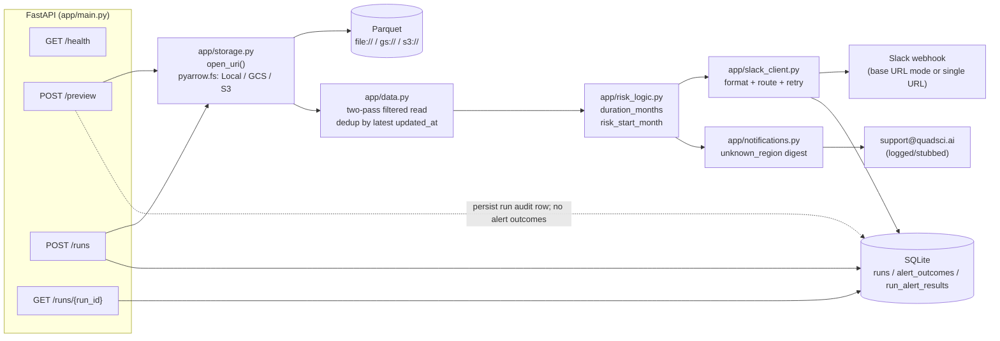
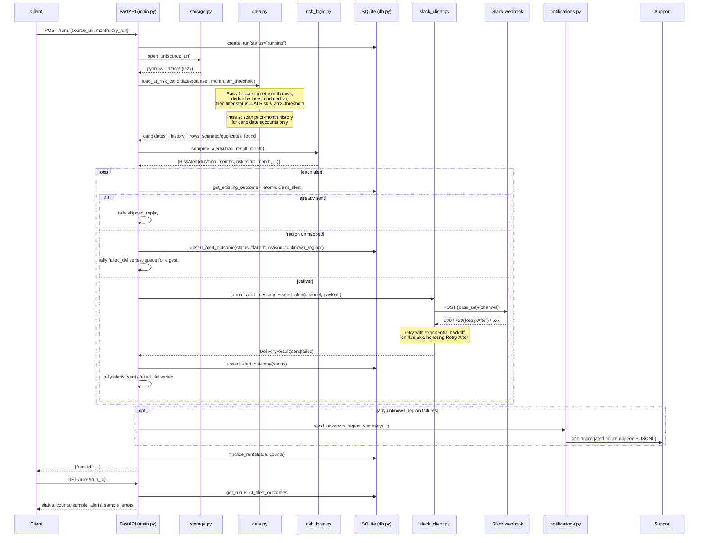

# Architecture

## Components

## Request sequence: `POST /runs`

## Key design choices

**Storage.** `open_uri()` dispatches on URI scheme to a `pyarrow.fs`
filesystem (local, GCS, S3) and returns a `pyarrow.dataset.Dataset`. All
three schemes share one code path, and callers always project columns and
push filters down at read time — nothing is fully materialized.

**Two-pass read.** Pass 1 scans only the target month, across all statuses,
and deduplicates *before* filtering to `At Risk`: the winning row (latest
`updated_at`) can carry a different status than the duplicate it beats, so
status has to be decided after dedup, not before. Pass 2 then scans only
the prior-month history of the accounts that survived pass 1. No unrelated
account or month is ever read. (See the README's "Replay safety" section
for the delivery-side mechanics — `sent` short-circuits, `failed` retries.)

**Why replay safety goes further than the spec asks.** The spec's minimum
bar is one unique-constrained table: check the existing outcome, skip if
`sent`, retry if `failed`. That's implemented, but two things go beyond it,
on purpose:

- `run_alert_results` is a separate, append-only audit table, distinct from
  the canonical `alert_outcomes` state. Without it, a later retry that
  flips a key from `failed` to `sent` would silently overwrite what an
  *earlier*, already-completed run reported for that account — so
  `GET /runs/{run_id}` for an old run could start lying about its own
  history the moment a later run touches the same key. This one is really
  a spec requirement in disguise: `GET /runs/{run_id}` promises sample
  alerts/errors per run, and that only stays true if each run's record is
  immutable.
- Delivery reserves a `pending` claim before calling Slack, and a stale
  claim can be reclaimed after `CLAIM_TIMEOUT_SECONDS`. This one is
  genuinely beyond what's asked — `/runs` is a single synchronous request,
  and the exercise doesn't require concurrent-run safety. I added it
  because a scheduler-triggered batch job like this realistically does
  double-fire (a timeout-and-retry from the scheduler, a manual re-run
  overlapping a scheduled one, two replicas racing), and a plain
  check-then-upsert has a real gap between the check and the send where
  that would double-post to Slack. The timeout exists so a process that
  dies mid-delivery doesn't strand that one account permanently — I hit
  exactly that failure mode while building this and fixed it (see
  `test_delivery_exception_after_claim_does_not_strand_the_alert`). It's
  more machinery than the exercise asks for; I kept it because the failure
  mode it closes is one I'd expect for real, not a hypothetical I invented
  to pad the design.

**No default Slack channel.** Unmapped or missing `account_region` never
reaches `slack_client` — it's recorded as `failed`/`unknown_region` and
rolled into one end-of-run notice to `support@quadsci.ai`.
